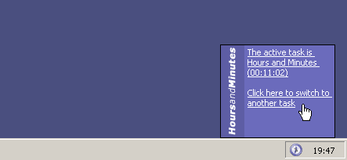
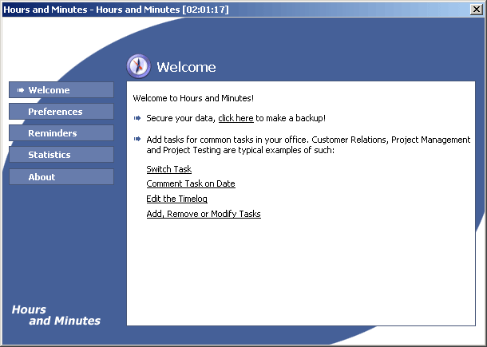

# Hours and Minutes 1.6

## Introduction

Hours and Minutes was a commercial software that I created in Visual Basic in the early 2000s. It was designed to run in the background of Windows, and allowed you to easily log the time what you worked with, by creating *tasks*, *comments* and *reminders*. You could then, at any time, generate a time sheet - *statistics*, or with the help of plugins, output the time data to Excel or SQL server. 

## The repository contains full source (in Visual Basic 6.0) for

* Hours and Minutes 1.6 
* Hours and Minutes Plugin Support Library
* Excel and SQL server plugins
* HTML Help Compiler project
* License Generator
* Inno Setup script
* Icons and graphics
* Binaries ready to install (see **bin\ham16.zip**), and license to unlock all features (see **Hours and Minutes License Generator\free.txt**)

## License

The source code is released under the [Creative Commons Attribution-NonCommercial 4.0 International (CC BY-NC 4.0) License](https://creativecommons.org/licenses/by-nc/4.0/). The complete license is also available in license.txt. For custom licensing please [contact me](mailto:fredrik@johanssonrobotics.com). Copyright © 2019 by Fredrik Johansson Robotics AB.

## Visual Basic 6.0 on Windows 10

To install Visual Basic 6.0 on Windows 10, please check out [Visual Studio 6 Installer](http://nuke.vbcorner.net/Articles/VB60/VisualStudio6Installer/tabid/93/language/en-US/Default.aspx).
